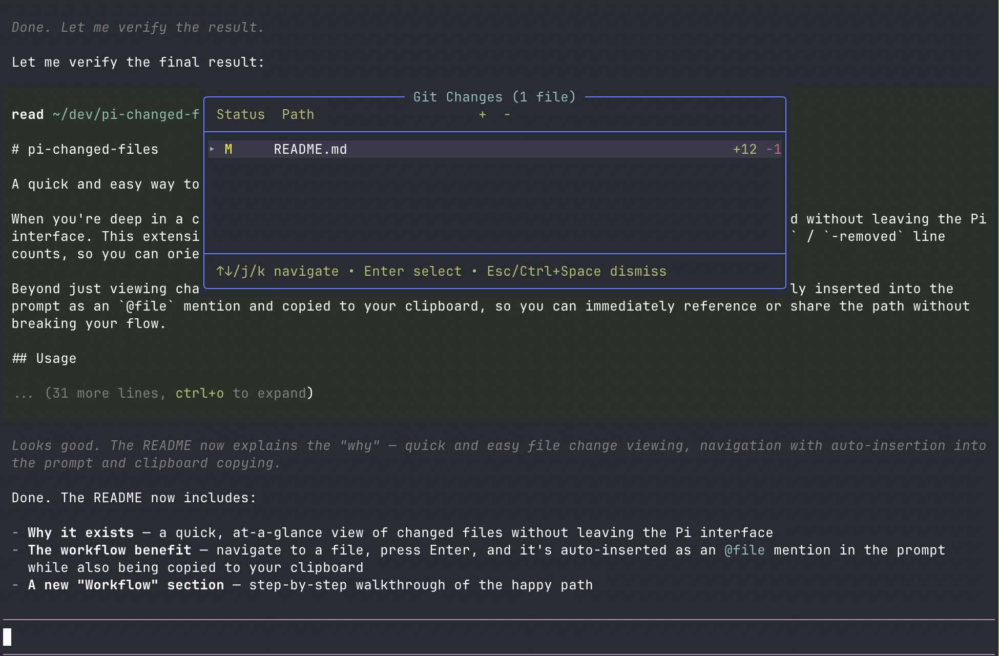

# pi-changed-files

A quick and easy way to see which files have changed in your working directory.

When you're deep in a coding session, it's helpful to have an at-a-glance view of what's changed without leaving the Pi interface. This extension shows a floating overlay of all git-modified files with their `+added` / `-removed` line counts, so you can orient yourself instantly.

Beyond just viewing changes, it lets you navigate the list and select a file — it's automatically inserted into the prompt as an `@file` mention and copied to your clipboard, so you can immediately reference or share the path without breaking your flow.



## Usage

### Install

```bash
# From git (unpinned — updates with `pi update --extensions`)
pi install git:github.com/therynamo/pi-changed-files

# Pin to a tag
pi install git:github.com/therynamo/pi-changed-files@v0.1.0

# Local development
pi install /Users/theryngroetken/dev/pi-changed-files
```

### Controls

- **Ctrl+Space** — Toggle the overlay
- **/changed-files** — Show the overlay via command
- **j/k** or **↑/↓** — Navigate the file list
- **Enter** — Copy the file path to clipboard and insert `@file` mention into the editor
- **Escape** — Dismiss the overlay

## What it shows

Files with working-tree or staged changes, sorted by status (deletions, renames, modifications, additions), with `+added` / `-removed` line counts from `git diff --numstat`.

## Workflow

1. Press **Ctrl+Space** to open the overlay
2. Use **j/k** to navigate to a changed file
3. Press **Enter** — the file path is copied to your clipboard and an `@file` mention is inserted into the prompt
4. Press **Escape** to dismiss when you're done
